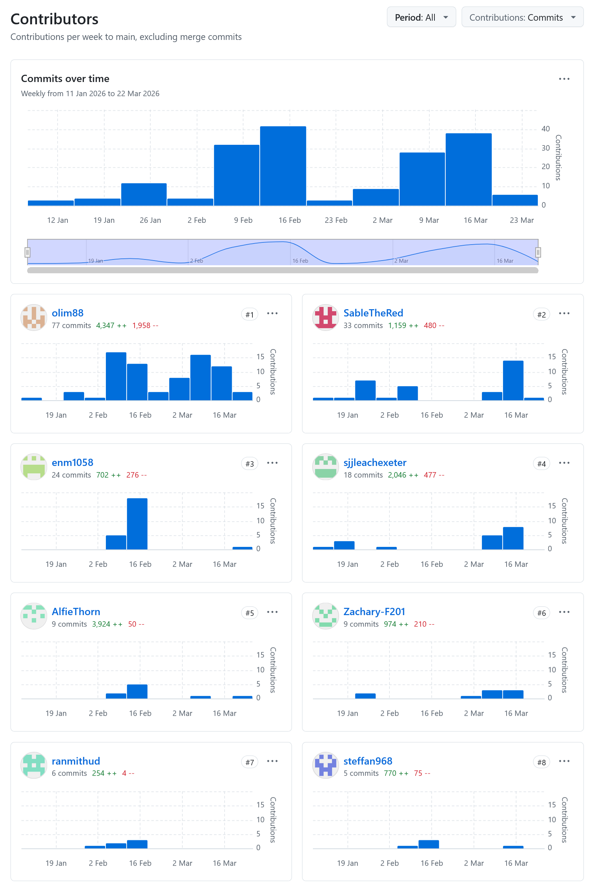

### Team member Responsibilities
1. Alfie Thorn
    - Position: Testing lead
    - Responsibilities: Writing a suite of tests, defining success criteria, managing user testing
2. Elliott McCarthy
    - Position: Database dev
    - Responsibilities: Filling databases with model data, handling fetch from database
3. Isobel Ryder
    - Position: UI dev
    - Responsibilities: HTML and handling website interface
4. Milo Rimmer
    - Position: Technical lead
    - Responsibilities: Backend cohesion, scanner development, software design consultant
5. Sebastian Leach
    - Position: Project owner
    - Responsibilites: Defining goals, UX (CSS) dev, Docs and Comms, presentation design
6. Steffan Griffiths
    - Position: Gamification dev
    - Responsibilities: Missions, quizs, levels
7. Vihandu Ranmith Udawatta
    - Position: Database dev
    - Responsibilites: Database schemas, filling databases with model data
8. Zac Fenton
    - Position: Scrum master
    - Responsibilities: Dictating workflows, assigning tasks, user login, privacy and GDPR

---
### As of Tuesday 24th March:

